# Soltura_DB

## ÍNDICE
- [Soltura\_DB](#soltura_db)
  - [ÍNDICE](#índice)
- [Integrantes:](#integrantes)
- [Documentación para el diseño](#documentación-para-el-diseño)
- [Población de datos](#población-de-datos)
- [Demostraciones T-SQL](#demostraciones-t-sql)
  - [1 y 2. Cursor local y global](#1-y-2-cursor-local-y-global)
  - [3. Trigger](#3-trigger)
  - [4. MERGE Y SP\_RECOMPILE.](#4-merge-y-sp_recompile)
      - [1. SQL Server Management Studio → SQL Server Agent → Jobs](#1-sql-server-management-studio--sql-server-agent--jobs)
      - [2. Click derecho → New Job y Name: "Soltura\_RecompileSPs\_Weekly"](#2-click-derecho--new-job-y-name-soltura_recompilesps_weekly)
      - [3. Steps: Agregar paso con "EXEC solturadb.sp\_RecompileAllSPs"](#3-steps-agregar-paso-con-exec-solturadbsp_recompileallsps)
      - [4. Schedule: Configurar para cada domingo a las 2:00 AM](#4-schedule-configurar-para-cada-domingo-a-las-200-am)
      - [5. Finalmente se verá así:](#5-finalmente-se-verá-así)
  - [5 COALESCE, SUBSTRING, LTRIM, SCHEMABINDING](#5-coalesce-substring-ltrim-schemabinding)
  - [6 AVG](#6-avg)
  - [7 TOP](#7-top)
  - [8 WITH ENCRYPTION](#8-with-encryption)
  - [9 EXECUTE AS y DISTINCT](#9-execute-as-y-distinct)
  - [10 UNION](#10-union)
- [Mantenimiento de la Seguridad](#mantenimiento-de-la-seguridad)
  - [Usuario sin acceso del todo.](#usuario-sin-acceso-del-todo)
  - [Usuario sin acceso al select.](#usuario-sin-acceso-al-select)
  - [Rol usuario con acceso a SP, pero nada más](#rol-usuario-con-acceso-a-sp-pero-nada-más)
  - [Ahora, RLS](#ahora-rls)
  - [Ahora con el certificado, llave simétrica, asimétrica y cifrados](#ahora-con-el-certificado-llave-simétrica-asimétrica-y-cifrados)
    - [Creada la master key, se puede crear el certificado:](#creada-la-master-key-se-puede-crear-el-certificado)
    - [Crear llave asimétrica:](#crear-llave-asimétrica)
    - [Crear llave simétrica:](#crear-llave-simétrica)
    - [Ahora para cifrar con la llave:](#ahora-para-cifrar-con-la-llave)
    - [Para descrifrar usando las llaves:](#para-descrifrar-usando-las-llaves)
- [Consultas Misceláneas](#consultas-misceláneas)
  - [Consulta sobre obtener un JSON](#consulta-sobre-obtener-un-json)
  - [Consulta y exportar a CSV.](#consulta-y-exportar-a-csv)
- [Concurrencia](#concurrencia)
- [Soltura ft. PaymentAssistant](#soltura-ft-paymentassistant)

---
# Integrantes:
- **Daniel Arce Campos** - Carnet: 2024174489
- **Allan David Bolaños Barrientos** - Carnet: 2024145458
- **Natalia Orozco Delgado** - Carnet: 2024099161
- **Isaac Villalobos Apellido2** - Carnet: !!!!
---

# Documentación para el diseño

---
# Población de datos

Script de llenado de base de datos cumpliendo los requerimientos de monedas, usuarios, suscripciones, catálogos base del sistema, empresas proveedoras de servicios y los planes de servicios.

```sql
USE soltura;
GO

-- Limpieza de las tablas en orden para evitar conflictos
DELETE FROM solturadb.soltura_redemptions;
DELETE FROM solturadb.soltura_planperson_users;
DELETE FROM solturadb.soltura_benefits;
DELETE FROM solturadb.soltura_planperson;
DELETE FROM solturadb.soltura_planprices;
DELETE FROM solturadb.soltura_contractDetails;
DELETE FROM solturadb.soltura_contracts;
DELETE FROM solturadb.soltura_companiesContactinfo;
DELETE FROM solturadb.soltura_associatedCompanies;
DELETE FROM solturadb.soltura_schedules;
DELETE FROM solturadb.soltura_categorybenefits;
DELETE FROM solturadb.soltura_redemptionMethods;
DELETE FROM solturadb.soltura_companyinfotypes;
DELETE FROM solturadb.soltura_subscriptions;
DELETE FROM dbo.soltura_benefitSubTypes;
DELETE FROM dbo.soltura_benefitTypes;

-- Resetear los contadores autoincrementables
DBCC CHECKIDENT ('solturadb.soltura_redemptions', RESEED, 1);
DBCC CHECKIDENT ('solturadb.soltura_benefits', RESEED, 1);
DBCC CHECKIDENT ('solturadb.soltura_planperson', RESEED, 1);
DBCC CHECKIDENT ('solturadb.soltura_planprices', RESEED, 1);
DBCC CHECKIDENT ('solturadb.soltura_contractDetails', RESEED, 1);
DBCC CHECKIDENT ('solturadb.soltura_contracts', RESEED, 1);
DBCC CHECKIDENT ('solturadb.soltura_companiesContactinfo', RESEED, 1);
DBCC CHECKIDENT ('solturadb.soltura_associatedCompanies', RESEED, 1);
DBCC CHECKIDENT ('solturadb.soltura_schedules', RESEED, 1);
DBCC CHECKIDENT ('solturadb.soltura_categorybenefits', RESEED, 1);
DBCC CHECKIDENT ('solturadb.soltura_redemptionMethods', RESEED, 1);
DBCC CHECKIDENT ('solturadb.soltura_companyinfotypes', RESEED, 1);
DBCC CHECKIDENT ('solturadb.soltura_subscriptions', RESEED, 1);


-- 1. Creación de monedas
IF NOT EXISTS(SELECT 1 FROM solturadb.soltura_currency WHERE name = 'United States Dollar')
BEGIN
    INSERT INTO solturadb.soltura_currency (name, acronym, symbol)
    VALUES 
        ('United States Dollar', 'USD', '$'),
        ('Costa Rican Colon', 'CRC', '₡'),
        ('Euro', 'EUR', '€'),
        ('Mexican Peso', 'MXN', '$'),
        ('Canadian Dollar', 'CAD', '$');
END

-- 2. Creación de tipos y subtipos de beneficios
INSERT INTO dbo.soltura_benefitTypes (benefitTypeId, name) VALUES 
    (1, 'Membresía Completa'),
    (2, 'Acceso Limitado'),
    (3, 'Descuento'),
    (4, 'Gratuidad'),
    (5, 'Consulta Individual'),
    (6, 'Servicio Premium');

INSERT INTO dbo.soltura_benefitSubTypes (benefitSubTypeId, name) VALUES
    (1, 'Mensual'),
    (2, 'Trimestral'),
    (3, 'Semestral'),
    (4, 'Anual'),
    (5, 'Por Visita'),
    (6, 'Por Hora'),
    (7, 'Porcentaje'),
    (8, 'Monto Fijo'),
    (9, 'Ilimitado');

-- 3. Creación de categorías de beneficios
INSERT INTO solturadb.soltura_categorybenefits (name, enabled) VALUES 
    ('Gimnasios', 0x01),
    ('Salud', 0x01),
    ('Educación', 0x01),
    ('Entretenimiento', 0x01),
    ('Gastronomía', 0x01),
    ('Transporte', 0x01),
    ('Hospedaje', 0x01),
    ('Coworking', 0x01);

INSERT INTO solturadb.soltura_countries (name, language, currencyid) VALUES 
('United States', 'en', 1),  
('Costa Rica', 'es', 2),   
('Puerto Rico', 'es', 1), 
('Panamá', 'es', 1);  
       
INSERT INTO solturadb.soltura_states (name, countryid) VALUES 
('San José', 2),       
('Alajuela', 2),
('California', 1),
('Texas', 1),
('San Juan', 3),
('Ciudad de Panamá', 4);

INSERT INTO solturadb.soltura_cities (name, stateid) VALUES 
('San José', 1),
('Escazú', 1),
('San Ramón', 2),
('Grecia', 2),
('Los Angeles', 3),
('San Francisco', 3),
('Dallas', 4),
('Austin', 4),
('Guaynabo', 5),
('San Miguelito', 6);

-- 4. Creación de empresas proveedoras de servicios 
-- Inserción de direcciones
INSERT INTO solturadb.soltura_addresses (line1, line2, zipcode, cityid, geoposition)
VALUES 
    ('Avenida Central', 'Edificio Torre A', '10101', 1, geometry::STGeomFromText('POINT(-84.08 9.93)', 4326)),
    ('Calle 5', 'Torre Médica', '10102', 2, geometry::STGeomFromText('POINT(-84.15 9.92)', 4326)),
    ('Boulevard Los Yoses', 'Campus Principal', '10103', 1, geometry::STGeomFromText('POINT(-84.10 9.94)', 4326)),
    ('Avenida Escazú', 'Local 102', '10104', 2, geometry::STGeomFromText('POINT(-84.05 9.92)', 4326)),
    ('Paseo Colón', 'Plaza Gastro', '10105', 1, geometry::STGeomFromText('POINT(-84.07 9.93)', 4326)),
    ('Terminal Central', NULL, '10201', 3, geometry::STGeomFromText('POINT(-84.22 10.02)', 4326)),
    ('Zona de Negocios', 'Torre Profesional', '10301', 4, geometry::STGeomFromText('POINT(-84.33 10.09)', 4326));

-- Inserción de usuarios
DECLARE @i INT = 1;
DECLARE @total_addresses INT;
SELECT @total_addresses = COUNT(*) FROM solturadb.soltura_addresses;

WHILE @i <= 30
BEGIN
    DECLARE @random_email NVARCHAR(100) = CONCAT('usuario', @i, '@gmail.com');
    DECLARE @random_firstname NVARCHAR(50) = CONCAT('Nombre', @i);
    DECLARE @random_lastname NVARCHAR(50) = CONCAT('Apellido', @i);
    DECLARE @random_birthday DATE = DATEADD(DAY, -1 * FLOOR(RAND() * 365 * 30), GETDATE());
    DECLARE @random_password VARBINARY(256) = HASHBYTES('SHA2_256', CONCAT('Contraseña', @i));
    DECLARE @random_address_id INT = FLOOR(RAND() * @total_addresses) + 1;

    INSERT INTO solturadb.soltura_users (email, firstname, lastname, birthday, password)
    VALUES (@random_email, @random_firstname, @random_lastname, @random_birthday, @random_password);

    INSERT INTO solturadb.soltura_useraddress (userid, addressid, useraddressid)
    VALUES (SCOPE_IDENTITY(), @random_address_id, @i);

    SET @i = @i + 1;
END

-- Inserción de empresas asociadas
INSERT INTO solturadb.soltura_associatedCompanies (name, addressId) VALUES 
    ('FitLife Gym', 1),         
    ('MediPlus', 2),            
    ('EduTech Academy', 3),     
    ('CinePlex', 4),           
    ('GastroClub', 5),         
    ('MobilityPass', 6),        
    ('WorkHub', 7);             

-- 5. Tipos de información de contacto
INSERT INTO solturadb.soltura_companyinfotypes (name) VALUES
    ('Email'),
    ('Teléfono'),
    ('Sitio Web'),
    ('Horario');

-- 6. Información de contacto para empresas
-- Utilizando un procedimiento para generar información de contacto
DECLARE @company_count INT = 7;
SET @i = 1;
DECLARE @email_domains TABLE (domain VARCHAR(50));
INSERT INTO @email_domains VALUES ('gmail.com'),('outlook.com'),('yahoo.com'),('company.com'),('business.com');

WHILE @i <= @company_count
BEGIN
    DECLARE @domain VARCHAR(50);
    SELECT TOP 1 @domain = domain FROM @email_domains ORDER BY NEWID();
    
    -- Email
    INSERT INTO solturadb.soltura_companiesContactinfo (value, enabled, lastupdate, companyinfotypeId, associatedCompaniesid)
    VALUES ('info@company' + CAST(@i AS VARCHAR) + '.' + @domain, 0x01, GETDATE(), 1, @i);
    
    -- Teléfono
    INSERT INTO solturadb.soltura_companiesContactinfo (value, enabled, lastupdate, companyinfotypeId, associatedCompaniesid)
    VALUES ('+506 2222-' + RIGHT('000' + CAST(1000 + @i * 111 AS VARCHAR), 4), 0x01, GETDATE(), 2, @i);
    
    -- Sitio web
    INSERT INTO solturadb.soltura_companiesContactinfo (value, enabled, lastupdate, companyinfotypeId, associatedCompaniesid)
    VALUES ('www.company' + CAST(@i AS VARCHAR) + '.com', 0x01, GETDATE(), 3, @i);
    
    -- Horario
    INSERT INTO solturadb.soltura_companiesContactinfo (value, enabled, lastupdate, companyinfotypeId, associatedCompaniesid)
    VALUES ('Lun-Vie: ' + CAST(7 + (@i % 3) AS VARCHAR) + ':00am - ' + CAST(7 + @i AS VARCHAR) + ':00pm', 0x01, GETDATE(), 4, @i);
    
    SET @i = @i + 1;
END

-- 7. Contratos con empresas proveedoras
INSERT INTO solturadb.soltura_contracts (name, date, expirationdate, associatedCompaniesid) 
VALUES
    ('Contrato FitLife 2025', '2025-01-01', '2025-12-31', 1),
    ('Acuerdo MediPlus 2025', '2025-01-15', '2026-01-15', 2),
    ('Convenio EduTech 2025', '2025-02-01', '2026-01-31', 3),
    ('Alianza CinePlex 2025', '2025-01-10', '2025-12-31', 4),
    ('Contrato GastroClub 2025', '2025-01-05', '2025-12-31', 5),
    ('Acuerdo MobilityPass 2025', '2025-01-01', '2025-12-31', 6),
    ('Convenio WorkHub 2025', '2025-01-01', '2025-12-31', 7);

-- 8. Detalles de contratos (usando un procedimiento para crear múltiples servicios por contrato)
DECLARE @contract_id INT = 1;
DECLARE @service_names TABLE (serviceid INT, name VARCHAR(100), description VARCHAR(200), price DECIMAL(10,2), soltura_pct DECIMAL(5,2), company_pct DECIMAL(5,2));

INSERT INTO @service_names VALUES
(1, 'Membresía Premium', 'Acceso completo a todas las instalaciones', 50.00, 0.20, 0.80),
(1, 'Pase Mensual', 'Acceso mensual a gimnasios', 30.00, 0.15, 0.85),
(1, 'Entrenamiento Personal', 'Sesiones con entrenador personal', 25.00, 0.25, 0.75),

(2, 'Consulta General', 'Consulta con médico general', 45.00, 0.25, 0.75),
(2, 'Exámenes Básicos', 'Panel de exámenes básicos', 60.00, 0.20, 0.80),
(2, 'Servicios Dentales', 'Limpieza y revisión dental', 55.00, 0.15, 0.85),

(3, 'Curso Completo', 'Curso completo de cualquier idioma', 200.00, 0.30, 0.70),
(3, 'Módulo Individual', 'Módulo individual de aprendizaje', 50.00, 0.25, 0.75),
(3, 'Biblioteca Digital', 'Acceso a biblioteca digital', 15.00, 0.20, 0.80),

(4, 'Entrada Premium', 'Entrada a cualquier película premium', 15.00, 0.18, 0.82),
(4, 'Combo Familiar', 'Combo para 4 personas con snacks', 40.00, 0.20, 0.80),
(4, 'Pase VIP', 'Acceso a salas VIP', 20.00, 0.22, 0.78),

(5, 'Descuento Restaurantes', 'Descuento en restaurantes de la cadena', 25.00, 0.15, 0.85),
(5, 'Café Gratis', 'Café gratis en establecimientos asociados', 5.00, 0.10, 0.90),
(5, 'Experiencia Gourmet', 'Degustación en restaurantes selectos', 45.00, 0.18, 0.82),

(6, 'Transporte Urbano', 'Acceso a transporte público ilimitado', 30.00, 0.12, 0.88),
(6, 'Alquiler Vehículos', 'Descuento en alquiler de vehículos', 40.00, 0.15, 0.85),
(6, 'Servicio Taxi', 'Descuento en servicios de taxi', 20.00, 0.10, 0.90),

(7, 'Acceso Diario', 'Acceso diario a espacio de coworking', 15.00, 0.20, 0.80),
(7, 'Membresía Mensual', 'Acceso mensual a espacios de trabajo', 120.00, 0.25, 0.75),
(7, 'Sala de Reuniones', 'Uso de salas de reuniones', 30.00, 0.18, 0.82);

INSERT INTO solturadb.soltura_contractDetails (name, description, contractid, price, solturaPercentage, companyPercentage)
SELECT name, description, serviceid, price, soltura_pct, company_pct
FROM @service_names;

-- 9. Métodos de redención
INSERT INTO solturadb.soltura_redemptionMethods (name, code) VALUES
    ('QR Code', 'Escanea el código QR en el establecimiento'),
    ('Código Digital', 'Usa este código en el establecimiento o sitio web'),
    ('Cupón', 'Presenta este cupón en el establecimiento'),
    ('Verificación ID', 'Muestra tu identificación en el establecimiento'),
    ('App Móvil', 'Redime a través de nuestra aplicación móvil');

-- 10. Creación de planes de suscripción
INSERT INTO solturadb.soltura_subscriptions ([description], [logourl]) VALUES 
    ('Joven Deportista', 'https://soltura.com/images/plans/joven-deportista.png'),
    ('Familia de Verano', 'https://soltura.com/images/plans/familia-verano.png'),
    ('Viajero Frecuente', 'https://soltura.com/images/plans/viajero-frecuente.png'),
    ('Nómada Digital', 'https://soltura.com/images/plans/nomada-digital.png'),
    ('Ejecutivo Plus', 'https://soltura.com/images/plans/ejecutivo-plus.png'),
    ('Estudiante Universitario', 'https://soltura.com/images/plans/estudiante.png'),
    ('Adulto Mayor Activo', 'https://soltura.com/images/plans/adulto-mayor.png'),
    ('Wellness Total', 'https://soltura.com/images/plans/wellness-total.png'),
    ('Plan Corporativo', 'https://soltura.com/images/plans/corporativo.png');

-- 11. Configuración de horarios para los planes (corregido con enddate no NULL)
INSERT INTO solturadb.soltura_schedules (name, recurrencytype, endtype, repetitions, enddate) VALUES
    ('Mensual', 'Monthly', 'Date', NULL, '2026-12-31'),
    ('Trimestral', 'Monthly', 'Event', 3, '2026-12-31'),
    ('Semestral', 'Monthly', 'Event', 6, '2026-12-31'),
    ('Anual', 'Monthly', 'Event', 12, '2026-12-31');

-- 12. Precios de planes en diferentes monedas
DECLARE @subscription_count INT = 9;
DECLARE @s INT = 1;

WHILE @s <= @subscription_count
BEGIN
    INSERT INTO solturadb.soltura_planprices (amount, recurrencytype, posttime, endate, [current], currencyid, subscriptionid)
    VALUES 
    (9.99 + (@s * 10), 1, GETDATE(), '2026-01-01', 0x01, 1, @s);
    
    INSERT INTO solturadb.soltura_planprices (amount, recurrencytype, posttime, endate, [current], currencyid, subscriptionid)
    VALUES 
    ((9.99 + (@s * 10)) * 500, 1, GETDATE(), '2026-01-01', 0x01, 2, @s);
    
    SET @s = @s + 1;
END

-- 13. Creación de planperson 
DECLARE @planprices_count INT;
SELECT @planprices_count = COUNT(*) FROM solturadb.soltura_planprices;

DECLARE @p INT = 1;
DECLARE @maxplanperson INT = 25; 
DECLARE @scheduleId INT;
DECLARE @planpriceId INT;
DECLARE @maxAccounts INT;

WHILE @p <= @maxplanperson
BEGIN
    SET @scheduleId = 1 + ((@p - 1) % 4);
    
    SET @planpriceId = 1 + ((@p - 1) % @planprices_count);
    
    SET @maxAccounts = CASE 
        WHEN @p % 3 = 0 THEN 4  
        WHEN @p % 3 = 1 THEN 2  
        ELSE 1                   
    END;
    
    INSERT INTO solturadb.soltura_planperson 
        (acquisition, enabled, scheduleid, planpricesid, expirationdate, maxaccounts)
    VALUES 
        (DATEADD(DAY, -1 * (@p * 3), GETDATE()), 0x01, @scheduleId, @planpriceId, DATEADD(YEAR, 1, GETDATE()), @maxAccounts);
    
    SET @p = @p + 1;
END

-- 14. Asignar usuarios a planes 
DECLARE @u INT = 1;
DECLARE @planpersonId INT;

WHILE @u <= 25  
BEGIN
    SET @planpersonId = 1 + ((@u - 1) % @maxplanperson);
    
    DECLARE @currentAccounts INT;
    SELECT @currentAccounts = COUNT(*) 
    FROM solturadb.soltura_planperson_users 
    WHERE planpersonid = @planpersonId;
    
    DECLARE @maxPermittedAccounts INT;
    SELECT @maxPermittedAccounts = maxaccounts 
    FROM solturadb.soltura_planperson 
    WHERE planpersonid = @planpersonId;
    
    IF @currentAccounts < @maxPermittedAccounts
    BEGIN
        INSERT INTO solturadb.soltura_planperson_users (planpersonid, userid)
        VALUES (@planpersonId, @u);
    END
    ELSE
    BEGIN
        DECLARE @alternativePlanId INT;
        
        SELECT TOP 1 @alternativePlanId = pp.planpersonid
        FROM solturadb.soltura_planperson pp
        LEFT JOIN (
            SELECT planpersonid, COUNT(*) as usercount 
            FROM solturadb.soltura_planperson_users 
            GROUP BY planpersonid
        ) as counts ON pp.planpersonid = counts.planpersonid
        WHERE ISNULL(counts.usercount, 0) < pp.maxaccounts
        ORDER BY NEWID();
        
        INSERT INTO solturadb.soltura_planperson_users (planpersonid, userid)
        VALUES (@alternativePlanId, @u);
    END
    
    SET @u = @u + 1;
END

-- 15. Creación de beneficios para los diferentes planes
DECLARE @planperson_count INT;
SELECT @planperson_count = COUNT(*) FROM solturadb.soltura_planperson;

DECLARE @contractDetail_count INT;
SELECT @contractDetail_count = COUNT(*) FROM solturadb.soltura_contractDetails;

DECLARE @category_count INT;
SELECT @category_count = COUNT(*) FROM solturadb.soltura_categorybenefits;

DECLARE @b INT = 1;
DECLARE @total_benefits INT = 75; 

WHILE @b <= @total_benefits
BEGIN
    DECLARE @planpersonId_b INT = 1 + ((@b - 1) % @planperson_count);
    DECLARE @categoryId INT = 1 + ((@b - 1) % @category_count);
    DECLARE @contractDetailId INT = 1 + ((@b - 1) % @contractDetail_count);
    DECLARE @benefitTypeId INT = 1 + ((@b - 1) % 6);
    DECLARE @benefitSubTypeId INT = 1 + ((@b - 1) % 9);
    
    DECLARE @benefitName NVARCHAR(100);
    DECLARE @benefitDesc NVARCHAR(255);
    
    SELECT @benefitName = 
        CASE @categoryId
            WHEN 1 THEN 'Beneficio Gimnasio ' + CAST(@b AS VARCHAR)
            WHEN 2 THEN 'Beneficio Salud ' + CAST(@b AS VARCHAR)
            WHEN 3 THEN 'Beneficio Educación ' + CAST(@b AS VARCHAR)
            WHEN 4 THEN 'Beneficio Entretenimiento ' + CAST(@b AS VARCHAR)
            WHEN 5 THEN 'Beneficio Gastronomía ' + CAST(@b AS VARCHAR)
            WHEN 6 THEN 'Beneficio Transporte ' + CAST(@b AS VARCHAR)
            WHEN 7 THEN 'Beneficio Hospedaje ' + CAST(@b AS VARCHAR)
            WHEN 8 THEN 'Beneficio Coworking ' + CAST(@b AS VARCHAR)
            ELSE 'Beneficio General ' + CAST(@b AS VARCHAR)
        END;
        
    SELECT @benefitDesc = 
        CASE @categoryId
            WHEN 1 THEN 'Descripción del beneficio de gimnasio ' + CAST(@b AS VARCHAR)
            WHEN 2 THEN 'Descripción del beneficio de salud ' + CAST(@b AS VARCHAR)
            WHEN 3 THEN 'Descripción del beneficio de educación ' + CAST(@b AS VARCHAR)
            WHEN 4 THEN 'Descripción del beneficio de entretenimiento ' + CAST(@b AS VARCHAR)
            WHEN 5 THEN 'Descripción del beneficio de gastronomía ' + CAST(@b AS VARCHAR)
            WHEN 6 THEN 'Descripción del beneficio de transporte ' + CAST(@b AS VARCHAR)
            WHEN 7 THEN 'Descripción del beneficio de hospedaje ' + CAST(@b AS VARCHAR)
            WHEN 8 THEN 'Descripción del beneficio de coworking ' + CAST(@b AS VARCHAR)
            ELSE 'Descripción del beneficio general ' + CAST(@b AS VARCHAR)
        END;
    
    INSERT INTO solturadb.soltura_benefits
        (enabled, name, description, availableuntil, planpersonid, categorybenefitsid, contractDetailId, benefitTypeId, benefitSubTypeId)
    VALUES
        (0x01, @benefitName, @benefitDesc, '2026-01-01', @planpersonId_b, @categoryId, @contractDetailId, @benefitTypeId, @benefitSubTypeId);
        
    SET @b = @b + 1;
END

-- 16. Registro de algunas redenciones de beneficios 
DECLARE @r INT = 1;
DECLARE @redemptions_count INT = 20;
DECLARE @benefit_count INT;

SELECT @benefit_count = COUNT(*) FROM solturadb.soltura_benefits;
DECLARE @user_count INT = 25; 

WHILE @r <= @redemptions_count
BEGIN
    DECLARE @userId_r INT = 1 + ((@r - 1) % @user_count);
    DECLARE @benefitId_r INT = 1 + ((@r - 1) % @benefit_count);
    DECLARE @redemptionMethodId INT = 1 + ((@r - 1) % 5);
    DECLARE @reference1 INT = 100000 + @r;
    DECLARE @reference2 INT = 200000 + @r; 
    DECLARE @value1 VARCHAR(100) = 'Redención ' + CAST(@r AS VARCHAR) + ' en empresa';
    DECLARE @value2 VARCHAR(100) = 'Detalle adicional ' + CAST(@r AS VARCHAR);
    
    INSERT INTO solturadb.soltura_redemptions
        (date, redemptionMethodsid, userid, benefitsid, reference1, reference2, value1, value2, checksum)
    VALUES
        (DATEADD(DAY, -1 * (@r % 30), GETDATE()), @redemptionMethodId, @userId_r, @benefitId_r, @reference1, @reference2,
         CONVERT(varbinary(100), @value1), CONVERT(varbinary(100), @value2), 0x0123456789);
        
    SET @r = @r + 1;
END

-- Verificación final de datos
SELECT 'Monedas' AS Tabla, COUNT(*) AS Cantidad FROM solturadb.soltura_currency
UNION ALL
SELECT 'Empresas Asociadas', COUNT(*) FROM solturadb.soltura_associatedCompanies
UNION ALL
SELECT 'Contratos', COUNT(*) FROM solturadb.soltura_contracts
UNION ALL
SELECT 'Detalles de Contratos', COUNT(*) FROM solturadb.soltura_contractDetails
UNION ALL
SELECT 'Planes de Suscripción', COUNT(*) FROM solturadb.soltura_subscriptions
UNION ALL
SELECT 'Personas con Plan', COUNT(*) FROM solturadb.soltura_planperson
UNION ALL
SELECT 'Usuarios con Plan', COUNT(*) FROM solturadb.soltura_planperson_users
UNION ALL
SELECT 'Beneficios', COUNT(*) FROM solturadb.soltura_benefits
UNION ALL
SELECT 'Redenciones', COUNT(*) FROM solturadb.soltura_redemptions;

-- Resumen de beneficios por tipo de suscripción
SELECT s.description AS 'Plan', 
       COUNT(DISTINCT b.benefitsid) AS 'Total Beneficios',
       STRING_AGG(b.name, ', ') WITHIN GROUP (ORDER BY b.name) AS 'Ejemplos de Beneficios'
FROM solturadb.soltura_benefits b
JOIN solturadb.soltura_planperson pp ON b.planpersonid = pp.planpersonid
JOIN solturadb.soltura_planprices ppr ON pp.planpricesid = ppr.planpricesid
JOIN solturadb.soltura_subscriptions s ON ppr.subscriptionid = s.subscriptionid
GROUP BY s.description
ORDER BY s.description;
```

---

# Demostraciones T-SQL
## 1 y 2. Cursor local y global 
```sql
USE soltura;
GO

-- PARTE 1: CURSOR LOCAL

DECLARE @benefitName VARCHAR(100);
DECLARE @benefitType VARCHAR(50);

DECLARE benefitCursor CURSOR LOCAL FOR
SELECT b.name, bt.name 
FROM solturadb.soltura_benefits b
JOIN dbo.soltura_benefitTypes bt ON b.benefitTypeId = bt.benefitTypeId
WHERE b.enabled = 0x01;

OPEN benefitCursor;
FETCH NEXT FROM benefitCursor INTO @benefitName, @benefitType;

PRINT 'Primeros 5 beneficios activos:';
DECLARE @count INT = 0;
WHILE @@FETCH_STATUS = 0 AND @count < 5
BEGIN
    PRINT 'Beneficio: ' + @benefitName + ' - De tipo: ' + @benefitType;
    FETCH NEXT FROM benefitCursor INTO @benefitName, @benefitType;
    SET @count = @count + 1;
END

CLOSE benefitCursor;
DEALLOCATE benefitCursor;

PRINT '(Al acceder desde otra sesión) Error: El cursor ''benefitCursor'' no existe o no está abierto.';


-- PARTE 2: CURSOR GLOBAL


DECLARE globalBenefitCursor CURSOR GLOBAL FOR
SELECT TOP 3 name FROM solturadb.soltura_benefits;


OPEN globalBenefitCursor;

-- Para acceder al cursor desde otra sesión
PRINT 'Cursor global creado - Para acceder desde otra sesión:';
PRINT 'DECLARE @name VARCHAR(100);';
PRINT 'FETCH NEXT FROM globalBenefitCursor INTO @name;';
PRINT 'PRINT @name;';


CLOSE globalBenefitCursor;
DEALLOCATE globalBenefitCursor;

-- VISIBILIDAD

PRINT '';
PRINT '-- RESULTADOS DE INTENTO DE ACCESO DESDE OTRA SESIÓN --';
PRINT 'Al intentar ejecutar en otra sesión:';
PRINT '';
PRINT '-- Intento de acceso al cursor LOCAL desde otra sesión --';
PRINT 'DECLARE @b VARCHAR(100);';
PRINT 'FETCH NEXT FROM benefitCursor INTO @b;';
PRINT '> Error: El cursor ''benefitCursor'' no existe.';
PRINT '';
PRINT '-- Intento de acceso al cursor GLOBAL desde otra sesión --';
PRINT 'DECLARE @gb VARCHAR(100);';
PRINT 'FETCH NEXT FROM globalBenefitCursor INTO @gb;';
PRINT 'PRINT @gb;';
PRINT '> Se imprime el primer beneficio del cursor global';
```
## 3. Trigger
En este script, se crea un trigger, que consiste en que cada vez que se crea un nuevo contrato se automatiza la creación del contract detail con la información del contrado recién insertado. Alguno de los valores se ponen de manera predeterminada para que luego segun el acuerdo se ajusta los precios y el porcentaje. La idea del trigger es facilitar a Soltura la tarea de tener que crear la tabla de contract details, sino que ya se crea y solo editan los datos del precio y porcentajes
```sql
CREATE TRIGGER trg_insert_default_detail
ON solturadb.soltura_contracts
--Este trigger se ejecuta después de insertar un nuevo contrato 
AFTER INSERT
AS
BEGIN
    --Insertamos las filas en la tabla de detalles de contrato
    INSERT INTO solturadb.soltura_contractDetails (name, description, contractid, price, solturaPercentage, companyPercentage)
    SELECT 
        --Ponemos datos por defecto para el detalle del contrato
        --Lo que se busca es que SolturaDB no tenga que crear un contractDetail, sino solo editrar sus datos segun los acuerdos
        'Detalle inicial', 
        'Detalle automático generado al crear el contrato', 
        i.contractid, 
        0.00, 
        0.00, 
        0.00  
    FROM inserted i; --Se insertan los detalles con los datos del contrado recien insertado
END;
GO

--Insertamos un contrato para probar el trigger
INSERT INTO solturadb.soltura_contracts (name, date, expirationdate, associatedCompaniesid)
VALUES 
('Contrato Prueba Trigger', '2023-10-01', '2024-10-01', 1);
GO
SELECT * FROM solturadb.soltura_contractDetails;
```

## 4. MERGE Y SP_RECOMPILE.

En este primero funciona, el merge como principal, en el segundo ya hablamos del SP_Recompile.

En este script, el "SP_RECOMPILE" se está utilizando para forzar la recompilación del plan de ejecución almacenado.
Ya que se están modificando los datos, esto sucede, que si más adelante, existen datos masivos, ese incremento, el SQL server podría usar un plan de ejecucuón obsoleto y modificar mal los datos. Entonces, cómo dependen entre sí las estadísticas, lo mejor es actualizar el plan que está en el caché

Y el merge garantaiza que todos los precios se actualicen en una única transacción. Es decir TODOS o ninguno, entonces, evita hacer múltiples operaciones.
```sql

-- Resulta y acontece que el CEO tomo una mala decisión y quiere ganar más plata, entonces va a suber los precios de los planes en un n% (en este ejemplo 5)
-- Así que profe, observe la magia, cómo ganamos más dineros.

-- Esta tabla se crea temporalmente, para almacenar los nuevos precios de los planes
CREATE TABLE #NuevosPreciosPlan (
    planpricesid INT PRIMARY KEY,
    nueva_cantidad DECIMAL(10,2),
    ultima_actualizacion DATETIME
);

-- Ahora insertamos los nuevos precios en la tabla temporal basada en los precios actuales
INSERT INTO #NuevosPreciosPlan (planpricesid, nueva_cantidad, ultima_actualizacion)
SELECT 
    pp.planpricesid,
    pp.amount * 1.05, -- 5% de aumento por inflación (Wink wink "inflación")....
    GETDATE()
FROM solturadb.soltura_planprices pp
WHERE pp.[current] = 0x01
  AND pp.endate > GETDATE(); -- Importante solo los planes activos

-- Aquí es dónde se usa el sp_recompile para forzar la recompilación de los planes de precios
EXEC sp_recompile 'solturadb.soltura_planprices';

-- Y ahora actualizamos los precios de los planes y mandamos los cambios
DECLARE @AuditChanges TABLE (
    planpricesid INT,
    precio_anterior DECIMAL(10,2),
    precio_nuevo DECIMAL(10,2),
    fecha_cambio DATETIME
);

-- El merge aquí, es quien se encarga de actualizar los precios de los planes
MERGE solturadb.soltura_planprices AS target
USING #NuevosPreciosPlan AS source -- Basado en la tabla temporal
ON (target.planpricesid = source.planpricesid)
WHEN MATCHED THEN
    UPDATE SET 
        target.amount = source.nueva_cantidad,
        target.posttime = source.ultima_actualizacion
OUTPUT 
    inserted.planpricesid, 
    deleted.amount, 
    inserted.amount, 
    GETDATE()
INTO @AuditChanges;

-- Originalmente en nuestro diagrama, no habíamos pensando en un historial de precios,
-- así que aquí lo creamos (no nos baje por favor.)
IF NOT EXISTS (SELECT * FROM sys.tables WHERE name = 'soltura_price_history' AND schema_id = SCHEMA_ID('solturadb'))
BEGIN
    CREATE TABLE solturadb.soltura_price_history (
        historyid INT IDENTITY(1,1) PRIMARY KEY,
        planpricesid INT NOT NULL,
        precio_anterior DECIMAL(10,2) NOT NULL,
        precio_nuevo DECIMAL(10,2) NOT NULL,
        fecha_cambio DATETIME NOT NULL,
        usuario_cambio NVARCHAR(128) DEFAULT SUSER_SNAME(),
        FOREIGN KEY (planpricesid) REFERENCES solturadb.soltura_planprices(planpricesid)
    );
END

-- Registrar los cambios en la tabla de historial
INSERT INTO solturadb.soltura_price_history (planpricesid, precio_anterior, precio_nuevo, fecha_cambio)
SELECT planpricesid, precio_anterior, precio_nuevo, fecha_cambio
FROM @AuditChanges;

-- Recompilamos los objetos que dependen de la tabla de precios
EXEC sp_recompile 'solturadb.soltura_benefits';

SELECT 
    pp.planpricesid,
    s.description AS 'Plan',
    c.symbol AS 'Moneda',
    ph.precio_anterior AS 'Precio Anterior',
    pp.amount AS 'Nuevo Precio',
    FORMAT((pp.amount - ph.precio_anterior) / ph.precio_anterior, 'P2') AS 'Porcentaje Incremento',
    ph.fecha_cambio AS 'Fecha Actualización'
FROM solturadb.soltura_planprices pp
JOIN solturadb.soltura_price_history ph ON pp.planpricesid = ph.planpricesid
JOIN solturadb.soltura_subscriptions s ON pp.subscriptionid = s.subscriptionid
JOIN solturadb.soltura_currency c ON pp.currencyid = c.currencyid
WHERE ph.fecha_cambio = (SELECT MAX(fecha_cambio) FROM solturadb.soltura_price_history)
ORDER BY s.description, c.symbol;

-- Limpiar la tabla temporal después de usarla (No hay que dejar evidencias)....
DROP TABLE #NuevosPreciosPlan;
```

SP_RECOMPILE SOLO:
En este usamos el procedimiento para forzar la recompilación de TODOS los planes de ejecución almacenados en caché. Pero la pregunta es 
¿Cómo recompilar todos los SPs existentes cada cierto tiempo?

Se puede crear un procedimiento master: en este caso el procedimiento sp_RecompileAllSPs que utiliza cursores para iterar sobre:
- Todos los procedimientos almacenados personalizados
- Todas las vistas indexadas
  
Y luego sería programar un mantenimiento para ejecutarse automáticamente:

#### 1. SQL Server Management Studio → SQL Server Agent → Jobs 

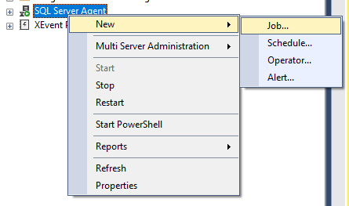

#### 2. Click derecho → New Job y Name: "Soltura_RecompileSPs_Weekly"
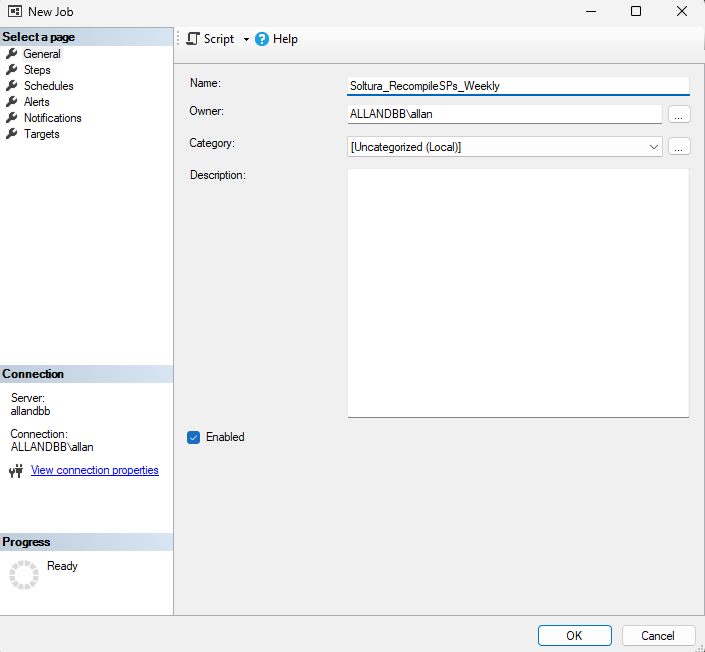

#### 3. Steps: Agregar paso con "EXEC solturadb.sp_RecompileAllSPs"
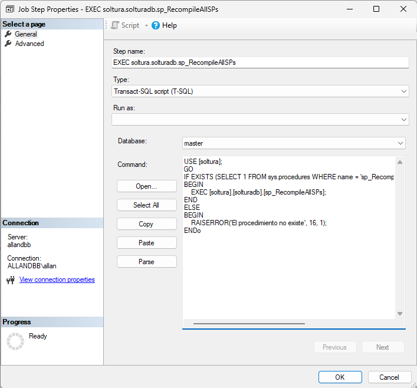

#### 4. Schedule: Configurar para cada domingo a las 2:00 AM
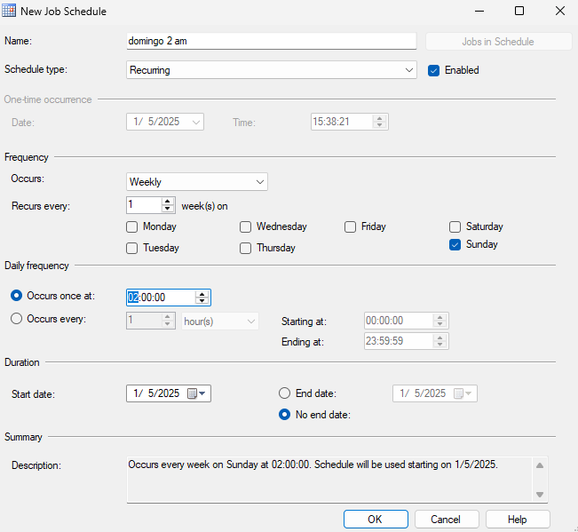

#### 5. Finalmente se verá así:
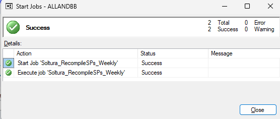

IMPORTANTE: Puede suceder que, sí no se había activado el SQL Agent, pueda tener problemas con los permisos, así que se adjunta un script en: "scripts/fixAgentSQL.sql" que al correrlo otorga los permisos necesarios.
```sql
USE soltura;
GO

-- Procedimiento simple para recompilar todos los SPs
CREATE OR ALTER PROCEDURE solturadb.sp_RecompileAllSPs
AS
BEGIN
    SET NOCOUNT ON;
    PRINT 'Iniciando recompilación: ' + CONVERT(VARCHAR, GETDATE(), 120);
    
    -- Cursor simple para recorrer todos los procedimientos
    DECLARE @sp_name NVARCHAR(255);
    DECLARE @sql NVARCHAR(500);
    DECLARE @count INT = 0;
    
    -- Seleccionar solo procedimientos personalizados (no de sistema)
    DECLARE sp_cursor CURSOR FOR 
        SELECT SCHEMA_NAME(schema_id) + '.' + name 
        FROM sys.procedures 
        WHERE is_ms_shipped = 0;
    
    OPEN sp_cursor;
    FETCH NEXT FROM sp_cursor INTO @sp_name;
    
    WHILE @@FETCH_STATUS = 0
    BEGIN
        SET @sql = N'EXEC sp_recompile ''' + @sp_name + '''';
        EXEC sp_executesql @sql;
        
        SET @count = @count + 1;
        FETCH NEXT FROM sp_cursor INTO @sp_name;
    END
    
    CLOSE sp_cursor;
    DEALLOCATE sp_cursor;
    
    -- También recompilar vistas indexadas
    DECLARE view_cursor CURSOR FOR 
        SELECT SCHEMA_NAME(v.schema_id) + '.' + v.name 
        FROM sys.views v
        JOIN sys.indexes i ON v.object_id = i.object_id
        WHERE i.index_id > 0;
    
    OPEN view_cursor;
    FETCH NEXT FROM view_cursor INTO @sp_name;
    
    WHILE @@FETCH_STATUS = 0
    BEGIN
        SET @sql = N'EXEC sp_recompile ''' + @sp_name + '''';
        EXEC sp_executesql @sql;
        
        SET @count = @count + 1;
        FETCH NEXT FROM view_cursor INTO @sp_name;
    END
    
    CLOSE view_cursor;
    DEALLOCATE view_cursor;
    
    PRINT 'Recompilación completada: ' + CONVERT(VARCHAR, GETDATE(), 120);
    PRINT 'Total objetos recompilados: ' + CAST(@count AS VARCHAR);
END;
GO
```
---
## 5 COALESCE, SUBSTRING, LTRIM, SCHEMABINDING
Aquí usamos efectivamente el schemabinding para enlazar la vista directamente al esquema de las tablas subyacentes.
Luego el coalesce para manejar valores NULL proporcionando un valor alternativo.
El LTRIM para eliminar espacios en blanco del lado izquierdo de una cadena.
Y el substring para extraer una parte específica de una cadena, en este caso el dominio de correo electrónico.
```sql
--
-- Este script crea una vista que muestra la información de contacto de las empresas asociadas,
-- usamos: schemabinding, coalesce, ltrim, substring.
--
--
CREATE VIEW solturadb.vw_CompanyContactInfo 
WITH SCHEMABINDING 
AS
SELECT 
    ac.associatedCompaniesid,
    ac.name AS CompanyName,
    -- Usa COALESCE para mostrar "Sin información" si el valor es NULL y que no se muestre el NULL en la consulta
    COALESCE(
        -- Usa LTRIM para eliminar espacios iniciales en los valores (Esto porque a veces vienen con espacios)
        LTRIM(CAST(ci.value AS NVARCHAR(255))), 
        'Sin información'
    ) AS ContactValue,
    CASE 
        WHEN cit.name = 'Email' THEN 
            -- Usa SUBSTRING para extraer el dominio después del @ (Para que salga bien bonito el dominio)
            CASE 
                WHEN CHARINDEX('@', CAST(ci.value AS NVARCHAR(255))) > 0 
                THEN SUBSTRING(
                    CAST(ci.value AS NVARCHAR(255)), 
                    CHARINDEX('@', CAST(ci.value AS NVARCHAR(255))) + 1,
                    LEN(CAST(ci.value AS NVARCHAR(255))) - CHARINDEX('@', CAST(ci.value AS NVARCHAR(255)))
                )
                ELSE 'Formato inválido'
            END
        ELSE NULL
    END AS EmailDomain,
    cit.name AS ContactType,
    ci.lastupdate AS LastUpdated
FROM solturadb.soltura_associatedCompanies ac
JOIN solturadb.soltura_companiesContactinfo ci ON ac.associatedCompaniesid = ci.associatedCompaniesid
JOIN solturadb.soltura_companyinfotypes cit ON ci.companyinfotypeId = cit.companyinfotypeId
WHERE ci.enabled = 0x01
GO

-- Consulta que utiliza la vista
SELECT 
    CompanyName,
    MAX(CASE WHEN ContactType = 'Email' THEN ContactValue END) AS Email,
    MAX(CASE WHEN ContactType = 'Email' THEN EmailDomain END) AS Domain,
    MAX(CASE WHEN ContactType = 'Teléfono' THEN ContactValue END) AS Phone,
    MAX(CASE WHEN ContactType = 'Sitio Web' THEN ContactValue END) AS Website,
    MAX(CASE WHEN ContactType = 'Horario' THEN ContactValue END) AS Schedule
FROM solturadb.vw_CompanyContactInfo
GROUP BY CompanyName
ORDER BY CompanyName;


-- Probar que el schema binding funciona:
ALTER TABLE solturadb.soltura_companyinfotypes
ALTER COLUMN name VARCHAR(150);
```
## 6 AVG
Con el AVG estamos agrupando para sacar un promedio de montos pagados.
```sqlv
-- AVG con agrupamiento (promedio de montos pagados por suscripción)
SELECT 
    s.description AS 'Plan',
    c.acronym AS 'Moneda',
    AVG(pp.amount) AS 'Precio Promedio'
FROM solturadb.soltura_planprices pp
JOIN solturadb.soltura_subscriptions s ON pp.subscriptionid = s.subscriptionid
JOIN solturadb.soltura_currency c ON pp.currencyid = c.currencyid
GROUP BY s.description, c.acronym
ORDER BY AVG(pp.amount) DESC;
```
## 7 TOP
Con el TOP estamos ahora sacando los planes más populars.
```sql
-- TOP para mostrar top 5 planes más populares
SELECT TOP 5 
    s.description AS 'Plan',
    COUNT(ppu.userid) AS 'Número de Usuarios'
FROM solturadb.soltura_subscriptions s
JOIN solturadb.soltura_planprices pp ON s.subscriptionid = pp.subscriptionid
JOIN solturadb.soltura_planperson p ON pp.planpricesid = p.planpricesid
JOIN solturadb.soltura_planperson_users ppu ON p.planpersonid = ppu.planpersonid
GROUP BY s.description
ORDER BY COUNT(ppu.userid) DESC;
```
3.  &&
``` sql
    -- && en T-SQL (explicación)
&& no se usa en T-SQL, en su lugar se utiliza AND para operaciones lógicas.
Ejemplo: WHERE condicion1 = 1 AND condicion2 = 2

```
## 8 WITH ENCRYPTION
## 9 EXECUTE AS y DISTINCT
En el procedimiento utilizamos WITH EXECUTE AS 'AuditUser' para ejecutar todo el código con los permisos limitados del usuario AuditUser 
y aplicamos DISTINCT en la consulta principal (COUNT(DISTINCT r.redemptionid)) para asegurar que cada redención se cuente exactamente una vez,

```sql
-- Script para almacenar la auditoría de redenciones
-- En este estamos usando: executa as y distinct.

USE soltura;
GO

-- Vamos a crear un usuario, con el que podamos hacer una auditoría y probar el EXECUTE AS
-- se le dan solo permisos de lectura a las tablas de redenciones, usuarios y beneficios.
IF NOT EXISTS (SELECT 1 FROM sys.database_principals WHERE name = 'AuditUser')
BEGIN
    CREATE USER AuditUser WITHOUT LOGIN;
    
    -- Dar permisos mínimos
    GRANT SELECT ON solturadb.soltura_redemptions TO AuditUser;
    GRANT SELECT ON solturadb.soltura_users TO AuditUser;
    GRANT SELECT ON solturadb.soltura_benefits TO AuditUser;
    GRANT INSERT ON solturadb.soltura_logs TO AuditUser;
END
GO

-- Procedimiento con EXECUTE AS que utiliza la tabla de logs que existen
CREATE OR ALTER PROCEDURE solturadb.sp_SimpleAudit
    @days INT = 7
WITH EXECUTE AS 'AuditUser'
AS
BEGIN
    DECLARE @log_description NVARCHAR(120); -- Descripción del log
    DECLARE @total_count INT; -- Total de redenciones en el período
    DECLARE @most_redeemed_benefit_id INT; -- ID del beneficio más redimido
    DECLARE @most_active_user_id INT; -- ID del usuario más activo
    
    SELECT @total_count = COUNT(DISTINCT r.redemptionid) -- OJO estamos el distinct para evitar contar redenciones duplicadas :D
    FROM solturadb.soltura_redemptions r
    WHERE r.date >= DATEADD(DAY, -@days, GETDATE());
    
    -- Esto solo es para buscar el beneficio más redimido
    SELECT TOP 1 @most_redeemed_benefit_id = benefitsid
    FROM solturadb.soltura_redemptions
    WHERE date >= DATEADD(DAY, -@days, GETDATE())
    GROUP BY benefitsid
    ORDER BY COUNT(*) DESC;
    
    -- Buscar el usuario más activio
    SELECT TOP 1 @most_active_user_id = userid
    FROM solturadb.soltura_redemptions
    WHERE date >= DATEADD(DAY, -@days, GETDATE())
    GROUP BY userid
    ORDER BY COUNT(*) DESC;
    
    SET @log_description = 'Audit: ' + CAST(@total_count AS VARCHAR) + ' redemptions in last ' + CAST(@days AS VARCHAR) + ' days';
    
    INSERT INTO solturadb.soltura_logs
       (description, posttime, computer, username, trace,
        referenceid1, referenceid2, value1, value2,
        checksum, logtypesid, logsourcesid, logseverityid)
    VALUES
       (@log_description,
        GETDATE(),
        HOST_NAME(),
        ORIGINAL_LOGIN(),
        'EXECUTE AS Audit',
        @most_active_user_id,  -- referenceid1 = El usuario más activo
        @most_redeemed_benefit_id,  -- referenceid2 = El beneficio más redimido
        @total_count,  -- value1 = total de redenciones
        @days,
        HASHBYTES('SHA2_256', @log_description),
        1,  
        1,  
        1   
       );
       
    SELECT 
        'Executing as: ' + USER_NAME() AS ExecutionContext,
        @total_count AS TotalRedemptions,
        @most_active_user_id AS MostActiveUserID,
        @most_redeemed_benefit_id AS MostRedeemedBenefitID,
        'Audit log created successfully' AS Status;
END;
GO

-- Dar permiso de ejecución al procedimiento almacenado
GRANT EXECUTE ON solturadb.sp_SimpleAudit TO PUBLIC;
GO

-- Ejecutar con distintos períodos de tiempo al sp 
EXEC solturadb.sp_SimpleAudit @days = 30;
```
## 10 UNION 

---

# Mantenimiento de la Seguridad

## Usuario sin acceso del todo.
Para poder crear un usuario en la base de datos que **NO** tenga acceso, creamos un user asociado a un login de la siguiente forma:

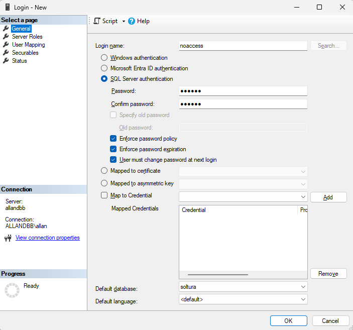

Posteriormente nos vemos a 'status' y removemos el permiso de acceso.

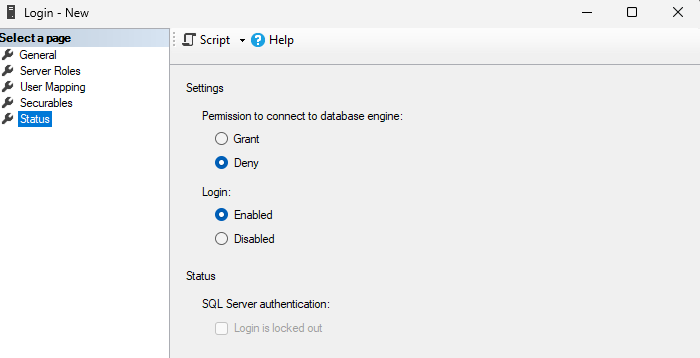

Si se desea que del todo **NO** se pueda conectar, le quitamos el permiso al inicio de sesión.


## Usuario sin acceso al select.
Para empezar vamos a crear los usuarios:

```sql
-- Crear usuario con permisos para select 
CREATE LOGIN selectPermsLogin WITH PASSWORD = '123456';
CREATE USER selectPermsUser FOR LOGIN selectPermsLogin;

-- Crear usuario SIN select, este mae se mete a mi base de datos y lo demando -.- 
CREATE LOGIN noSelectPermsLogin WITH PASSWORD = '123456';
CREATE USER noSelectPermsUser FOR LOGIN noSelectPermsLogin;
```

Ahora creamos los roles y asignamos a los usuarios:
```sql
-- Rol con permiso de SELECT
CREATE ROLE rolSelect;

-- Rol sin permisos explícitos
CREATE ROLE rolNoSelect;

-- Asignar usuarios a roles
EXEC sp_addrolemember 'rolSelect', 'selectPermsUser';
EXEC sp_addrolemember 'rolNoSelect', 'noSelectPermsUser';
GO
```

Y aquí es dónde decidimos los permisos que un usuario puede tener, en este caso le doy select al de rolSelect en users.
```sql
GRANT SELECT ON solturadb.soltura_users TO rolSelect;
```

Si nosotros iniciamos con "noSelectPermsLogin" e intenteamos hacer el select, pasará lo siguiente:

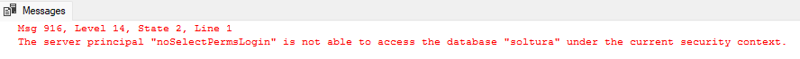

Por el contrario si iniciamos con el usuario que si tiene los permisos, y queremos corroborar las tablas, solo tiene acceso a user:

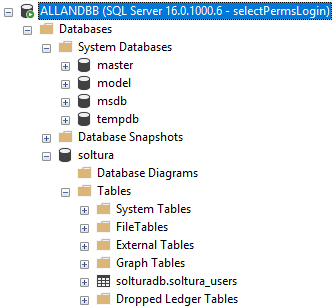

Y si ejecutamos el select podremos ver que funciona correctamente:

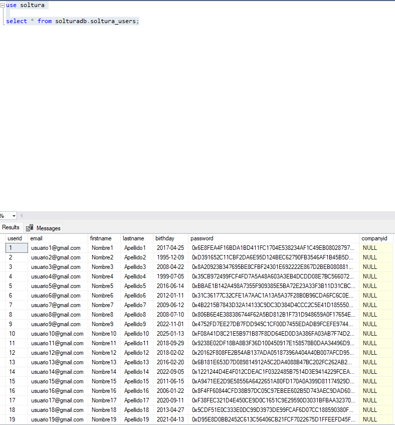

## Rol usuario con acceso a SP, pero nada más
Entonces, si se desea que el usuario pueda usar un SP para ver una tabla, pero no darle accesos directos se puede hacer :D

Para no crear otro usuario, voy a usar el mismo que creamos antes de "noSelectPermsUser", este no tiene permisos de nada.

Y voy a crear un SP simple para ver la tabla de usuarios.
```sql
CREATE PROCEDURE sp_consultarUsers
WITH EXECUTE AS OWNER
AS
BEGIN
    SELECT * FROM solturadb.soltura_users;
END;
GO
```

Y ahora, al usuario, le vamos a dar permisos de usar el SP.
```sql
GRANT EXECUTE ON sp_consultarUsers TO noSelectPermsUser;
```

Entonces, si lo probamos, vamos a ver que ni si quiera reconoce la tabla que puse arriba para el select, pero si puedo ejecutar el SP.

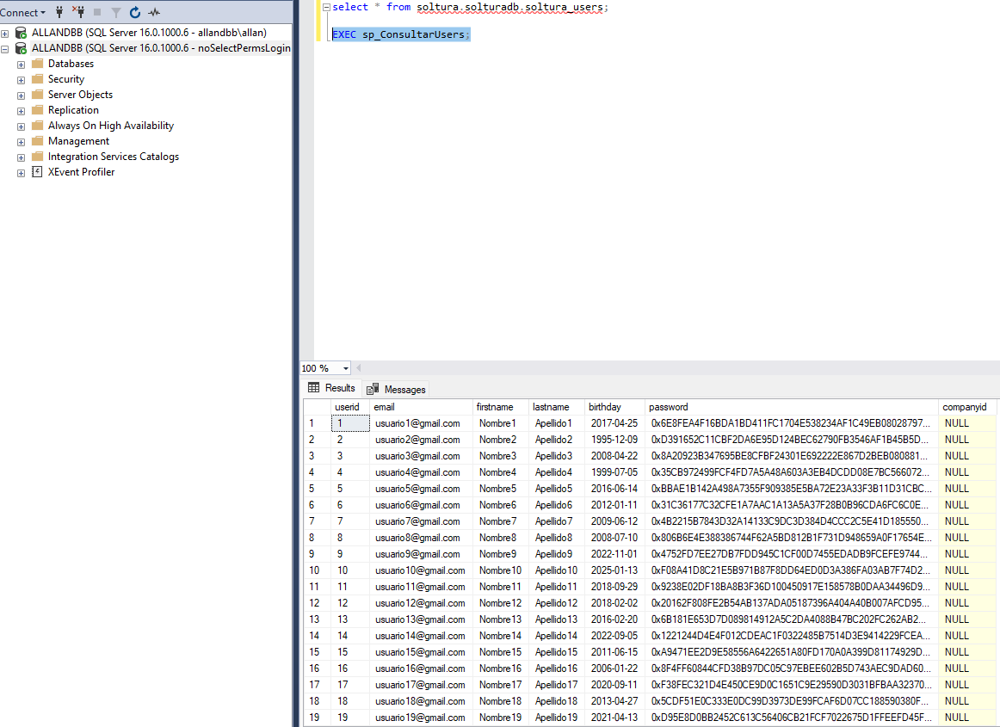


## Ahora, RLS
Si se quiere implementar un Row Level Security, entonces:
Hago el ejemplo para que un usuario SOLO pueda tener sus datos de suscripcción.

- Primero se necesita crear la función "predicado", la cuál me permite escoger que filas accesa y cuáles no
```sql
CREATE OR ALTER FUNCTION [solturadb].[SecurityPredicatePlanperson](@UserId INT)
RETURNS TABLE
WITH SCHEMABINDING
AS
RETURN
    SELECT 1 AS result
    WHERE @UserId = CAST(SESSION_CONTEXT(N'UserId') AS INT);
GO
```

- Acá, se crea entonces la función predicado, lo que involucra crear ahora la política que nos permite el acecso

```sql
CREATE SECURITY POLICY [solturadb].[PlanpersonFilter]
ADD FILTER PREDICATE [solturadb].[SecurityPredicatePlanperson]([userid]) -- Filtra por el predicado que pusimos
ON [solturadb].[soltura_planperson_users]
WITH (STATE = ON);
GO
```
- Y por último se crea el contexto, que es lo que nos permite por medio de un SP, ejecutarlo 
  
```sql
CREATE OR ALTER PROCEDURE [solturadb].[SetUserContext]
    @UserId INT
AS
BEGIN
    EXEC sp_set_session_context @key = N'UserId', @value = @UserId;
END;
GO
```

Entonces, ya si se desea usar, en este caso, que puse el userId para no crear usuarios para probar un ejemplo:
```sql
EXEC [solturadb].[SetUserContext] @UserId = 1; -- Ponemos el contexto para el userId 1.

-- Se puede cambiar el userId para probar con otros usuarios.

-- Ahora, si el usuario 1 ejecuta un select a la tabla, solo verá sus datos.
SELECT pu.planpersonid, pu.userid, pp.acquisition, pp.enabled, s.description AS 'Plan'
FROM [solturadb].[soltura_planperson_users] pu
JOIN [solturadb].[soltura_planperson] pp ON pu.planpersonid = pp.planpersonid
JOIN [solturadb].[soltura_planprices] ppr ON pp.planpricesid = ppr.planpricesid
JOIN [solturadb].[soltura_subscriptions] s ON ppr.subscriptionid = s.subscriptionid;
```

Y lo vemos así:

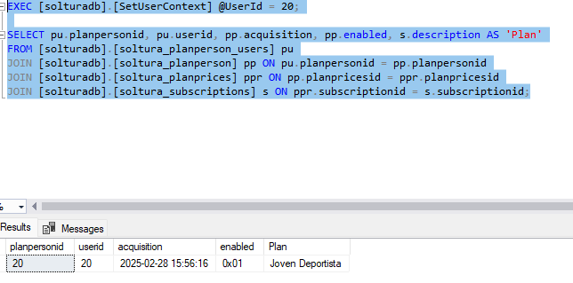

## Ahora con el certificado, llave simétrica, asimétrica y cifrados

Como vimos en clase un certificado se usa para cifrar, firmar y proteger otros objetos o llaves.
Por otra parte las llaves asimétricas son similares, solo que no son 1:1.

Lo primero, es que hay que tener definido la master key, que por default no está.
```sql
CREATE MASTER KEY ENCRYPTION BY PASSWORD = '123456'; -- La master key protege todo lo demás digamos.
GO
```

### Creada la master key, se puede crear el certificado:
```sql
CREATE CERTIFICATE CertificadoSoltura
WITH SUBJECT = 'Certificado para seguridad en Soltura',
EXPIRY_DATE = '2030-12-31';

SELECT * FROM sys.certificates WHERE name = 'CertificadoSoltura';
GO
```

Evidencia:

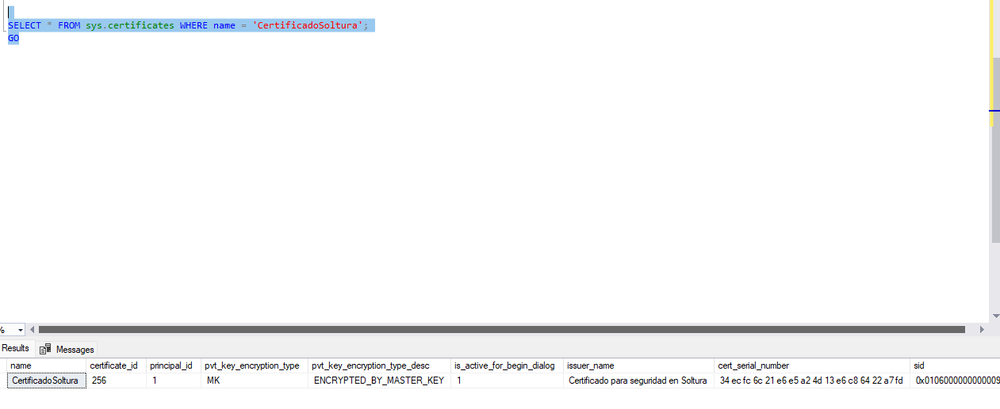

### Crear llave asimétrica:
```sql
CREATE ASYMMETRIC KEY LlaveAsimSoltura
WITH ALGORITHM = RSA_2048; -- Esto es el algoritmo y cantidad de bits para cifrar, tmb existe: 512, 1024.
GO

SELECT * FROM sys.asymmetric_keys WHERE name = 'LlaveAsimSoltura';
```

Evidencia:

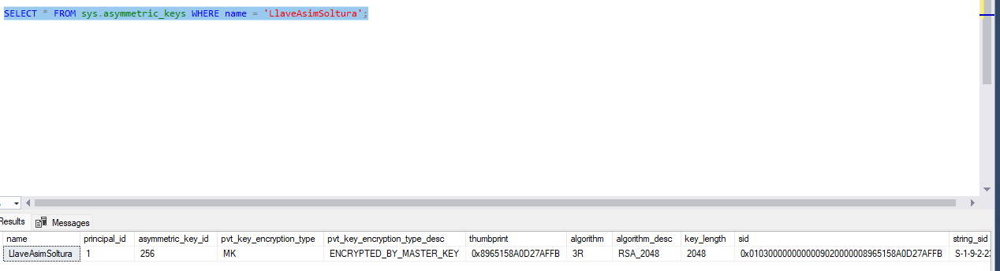

### Crear llave simétrica:
```sql
-- Esta se puede crear cifrando con certificado o con una llave asimétrica:
-- 1) Con certificado:
CREATE SYMMETRIC KEY LlaveSimSoltura
WITH ALGORITHM = AES_256
ENCRYPTION BY CERTIFICATE CertificadoSoltura; 
GO

-- 2) Con llave asimétrica:
CREATE SYMMETRIC KEY LlaveSimSoltura2
WITH ALGORITHM = AES_256
ENCRYPTION BY ASYMMETRIC KEY LlaveAsimSoltura;
GO

SELECT * FROM sys.symmetric_keys WHERE name = 'LlaveSimSoltura';
```

Y se ve así:

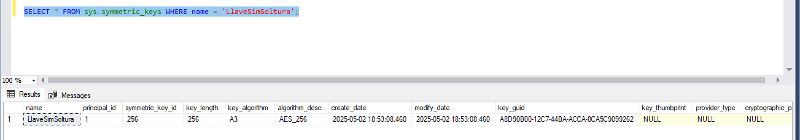


### Ahora para cifrar con la llave:
```sql
CREATE OR ALTER PROCEDURE [solturadb].[SP_CifrarPassword]
    @UserId INT,
    @Password NVARCHAR(50)
AS
BEGIN
    SET NOCOUNT ON;
    IF NOT EXISTS (SELECT 1 FROM solturadb.soltura_users WHERE userid = @UserId)
    BEGIN
        RAISERROR('Usuario no encontrado', 16, 1);
        RETURN;
    END
    
    -- Abrir la llave simétrica
    OPEN SYMMETRIC KEY LlaveSimSoltura
    DECRYPTION BY CERTIFICATE CertificadoSoltura;
    
    -- Cifrar el password y actualizar el usuario
    UPDATE solturadb.soltura_users
    SET password = EncryptByKey(Key_GUID('LlaveSimSoltura'), @Password)
    WHERE userid = @UserId;
    
    -- Cerrar la llave
    CLOSE SYMMETRIC KEY LlaveSimSoltura;
    
    PRINT 'Contraseña cifrada y guardada correctamente';
END;
GO
```

### Para descrifrar usando las llaves:
```sql
CREATE OR ALTER PROCEDURE [solturadb].[SP_VerificarPassword]
    @UserId INT,
    @Password NVARCHAR(50),
    @EsCorrecta BIT OUTPUT
AS
BEGIN
    SET NOCOUNT ON;
    SET @EsCorrecta = 0;
    
    DECLARE @PasswordGuardado NVARCHAR(50);
    
    -- Abrir la llave simétrica
    OPEN SYMMETRIC KEY LlaveSimSoltura
    DECRYPTION BY CERTIFICATE CertificadoSoltura;
    
    -- Obtener y descifrar el password almacenado
    SELECT @PasswordGuardado = CONVERT(NVARCHAR(50), 
        DecryptByKey(password))
    FROM solturadb.soltura_users
    WHERE userid = @UserId;
    
    -- Cerrar la llave
    CLOSE SYMMETRIC KEY LlaveSimSoltura;
    
    -- Verificar la contraseña
    IF @PasswordGuardado = @Password
        SET @EsCorrecta = 1;
END;
GO
```

Un ejemplo de uso:
```sql
-- para cifrar una contraseña de un usuario:
EXEC solturadb.SP_CifrarPassword @UserId = 1, @Password = '1234567';

-- Y para verficar la contraseña de un usuario:
DECLARE @Resultado BIT;
EXEC solturadb.SP_VerificarPassword @UserId = 1, @Password = '1234567', @EsCorrecta = @Resultado OUTPUT;
SELECT @Resultado AS PasswordCorrecto;
```
---
# Consultas Misceláneas
## Crear una vista indexada con al menos 4 tablas (ej. usuarios, suscripciones, pagos, servicios). La vista debe ser dinámica, no una vista materializada con datos estáticos. Demuestre que si es dinámica.
```sql
--La vista indexada
CREATE VIEW solturadb.vw_UserSubscriptionDetails
WITH SCHEMABINDING
AS
SELECT 
    u.userid,
    u.firstname,
    u.lastname,
    pp.planpersonid,
    s.subscriptionid,
    s.description AS subscription_description,
    ppr.amount AS subscription_price,
    ppr.currencyid,
    b.benefitsid,
    b.name AS benefit_name,
    b.description AS benefit_description,
    b.availableuntil
FROM 
    solturadb.soltura_users u
JOIN 
    solturadb.soltura_planperson_users ppu ON u.userid = ppu.userid
JOIN 
    solturadb.soltura_planperson pp ON ppu.planpersonid = pp.planpersonid
JOIN 
    solturadb.soltura_planprices ppr ON pp.planpricesid = ppr.planpricesid
JOIN 
    solturadb.soltura_subscriptions s ON ppr.subscriptionid = s.subscriptionid
JOIN 
    solturadb.soltura_benefits b ON pp.planpersonid = b.planpersonid;
GO


CREATE UNIQUE CLUSTERED INDEX IX_vw_UserSubscriptionDetails
ON solturadb.vw_UserSubscriptionDetails (userid, planpersonid, benefitsid);
GO


-- Para probar que es dinámica hacemos esta inserción

INSERT INTO solturadb.soltura_benefits
    (enabled, name, description, availableuntil, planpersonid, categorybenefitsid, contractDetailId, benefitTypeId, benefitSubTypeId)
VALUES
    (0x01, 'Nuevo Beneficio', 'Descripción del nuevo beneficio', '2026-12-31', 1, 1, 1, 1, 1);
GO

-- Consultar la vista para verificar que el nuevo beneficio aparece
SELECT *
FROM solturadb.vw_UserSubscriptionDetails
WHERE planpersonid = 1;
GO
```

## Crear un procedimiento almacenado transaccional que realice una operación del sistema, relacionado a subscripciones, pagos, servicios, transacciones o planes, y que dicha operación requiera insertar y/o actualizar al menos 3 tablas.

```sql

-- Procedimiento
CREATE PROCEDURE solturadb.sp_RegistrarNuevoPlan
    @SubscriptionDescription NVARCHAR(255),
    @LogoUrl NVARCHAR(255),
    @Amount DECIMAL(10, 2),
    @CurrencyId INT,
    @RecurrencyType SMALLINT, 
    @UserId INT,
    @MaxAccounts INT
AS
BEGIN
    SET NOCOUNT ON;

    BEGIN TRY
        
        BEGIN TRANSACTION;

        -- 1. Tabla 1
        DECLARE @SubscriptionId INT;
        INSERT INTO solturadb.soltura_subscriptions ([description], [logourl])
        VALUES (@SubscriptionDescription, @LogoUrl);
        SET @SubscriptionId = SCOPE_IDENTITY();

        -- 2. Tabla 2
        DECLARE @PlanPriceId INT;
        INSERT INTO solturadb.soltura_planprices (amount, recurrencytype, posttime, endate, [current], currencyid, subscriptionid)
        VALUES (@Amount, @RecurrencyType, GETDATE(), '2026-01-01', 0x01, @CurrencyId, @SubscriptionId);
        SET @PlanPriceId = SCOPE_IDENTITY();

        -- 3. Tabla 3
        INSERT INTO solturadb.soltura_planperson (acquisition, enabled, scheduleid, planpricesid, expirationdate, maxaccounts)
        VALUES (GETDATE(), 0x01, 1, @PlanPriceId, DATEADD(YEAR, 1, GETDATE()), @MaxAccounts);

     
        COMMIT TRANSACTION;
    END TRY
    BEGIN CATCH
        -- Revertir la transacción en caso de error
        ROLLBACK TRANSACTION;

        THROW;
    END CATCH
END;
GO


-- Prueba
EXEC solturadb.sp_RegistrarNuevoPlan
    @SubscriptionDescription = 'Plan Familiar',
    @LogoUrl = 'https://soltura.com/images/plans/plan-familiar.png',
    @Amount = 49.99,
    @CurrencyId = 1, 
    @RecurrencyType = 1,
    @UserId = 1,
    @MaxAccounts = 5;

SELECT * FROM solturadb.soltura_planperson WHERE planpricesid = (SELECT planpricesid FROM solturadb.soltura_planprices WHERE subscriptionid = (SELECT subscriptionid FROM solturadb.soltura_subscriptions WHERE [description] = 'Plan Familiar'));

```

## Escribir un SELECT que use CASE para crear una columna calculada que agrupe dinámicamente datos (por ejemplo, agrupar cantidades de usuarios por plan en rangos de monto, no use este ejemplo).

```sql

-- Agrupa según el tipo de plan, cuántos hay de cada uno y su tipo (individuales, grupo pequeño o grande)
SELECT 
    s.description AS [Plan],
    COUNT(DISTINCT pp.planpersonid) AS TotalPlanes,
    CASE 
        WHEN pp.maxaccounts = 1 THEN 'Individual'
        WHEN pp.maxaccounts BETWEEN 2 AND 4 THEN 'Grupo pequeño'
        WHEN pp.maxaccounts > 4 THEN 'Grupo grande'
        ELSE 'Sin Clasificar'
    END AS TipoPlan
FROM 
    solturadb.soltura_planperson pp
JOIN 
    solturadb.soltura_planprices ppr ON pp.planpricesid = ppr.planpricesid
JOIN 
    solturadb.soltura_subscriptions s ON ppr.subscriptionid = s.subscriptionid
GROUP BY 
    s.description,
    CASE 
        WHEN pp.maxaccounts = 1 THEN 'Individual'
        WHEN pp.maxaccounts BETWEEN 2 AND 4 THEN 'Grupo pequeño'
        WHEN pp.maxaccounts > 4 THEN 'Grupo grande'
        ELSE 'Sin Clasificar'
    END
ORDER BY 
    TipoPlan, [Plan];
```

## Imagine una cosulta que el sistema va a necesitar para mostrar cierta información, o reporte o pantalla, y que esa consulta vaya a requerir: 4 JOINs entre tablas, 2 funciones agregadas (ej. SUM, AVG), 3 subconsultas or 3 CTEs, Un CASE, CONVERT, ORDER BY, HAVING, una función escalar, y operadores como IN, NOT IN, EXISTS. Escriba dicha consulta y ejecutela con el query analizer, utilizando el analizador de pesos y costos del plan de ejecución, reacomode la consulta para que sea más eficiente sin necesidad de agregar nuevos índices.

```sql

--OG

WITH BeneficiosPopulares AS (
   
    SELECT 
        b.benefitsid,
        b.name,
        COUNT(r.redemptionid) AS redemption_count
    FROM solturadb.soltura_benefits b
    JOIN solturadb.soltura_redemptions r ON b.benefitsid = r.benefitsid
    WHERE EXISTS (
        SELECT 1 FROM solturadb.soltura_planperson pp 
        WHERE pp.planpersonid = b.planpersonid
    )
    GROUP BY b.benefitsid, b.name
    HAVING COUNT(r.redemptionid) > 0
),

PlanesConUsuarios AS (
   
    SELECT 
        pp.planpricesid,
        COUNT(DISTINCT ppu.userid) AS user_count
    FROM solturadb.soltura_planperson pp
    JOIN solturadb.soltura_planperson_users ppu ON pp.planpersonid = ppu.planpersonid
    WHERE pp.planpricesid NOT IN (
        SELECT planpricesid 
        FROM solturadb.soltura_planprices 
        WHERE amount <= 0
    )
    GROUP BY pp.planpricesid
),

RedencionesPorPlan AS (
   
    SELECT 
        pp.planpricesid,
        COUNT(r.redemptionid) AS redemption_count,
        CONVERT(VARCHAR(10), MAX(r.date), 120) AS last_redemption_date
    FROM solturadb.soltura_redemptions r
    JOIN solturadb.soltura_benefits b ON r.benefitsid = b.benefitsid
    JOIN solturadb.soltura_planperson pp ON b.planpersonid = pp.planpersonid
    GROUP BY pp.planpricesid
)

SELECT 
    s.subscriptionid,
    s.description AS plan_name,
    
    AVG(pp.amount) AS average_price,
    SUM(CASE 
        WHEN pc.user_count > 100 THEN 1 
        ELSE 0 
    END) AS popular_plans_count,
    
    CONVERT(VARCHAR(10), 
        CASE 
            WHEN AVG(pp.amount) < 20 THEN 'Económico'
            WHEN AVG(pp.amount) BETWEEN 20 AND 50 THEN 'Estándar'
            ELSE 'Premium'
        END
    ) AS price_category,
    bp.name AS most_popular_benefit,
    rp.last_redemption_date
FROM solturadb.soltura_subscriptions s
JOIN solturadb.soltura_planprices pp ON s.subscriptionid = pp.subscriptionid
JOIN PlanesConUsuarios pc ON pp.planpricesid = pc.planpricesid
LEFT JOIN RedencionesPorPlan rp ON pp.planpricesid = rp.planpricesid
LEFT JOIN (
    SELECT TOP 1 b.* 
    FROM BeneficiosPopulares b
    ORDER BY b.redemption_count DESC
) bp ON 1=1 
WHERE pc.user_count > 0
GROUP BY 
    s.subscriptionid,
    s.description,
    bp.name,
    rp.last_redemption_date,
    pc.user_count
HAVING AVG(pp.amount) > 0 
ORDER BY 
    price_category DESC,
    average_price DESC;


-- OPTIMIZADA
WITH PlanesValidos AS (
    SELECT 
        planpricesid,
        subscriptionid,
        amount
    FROM solturadb.soltura_planprices
    WHERE amount > 0
),

BeneficioMasPopular AS (
    SELECT TOP 1
        b.benefitsid,
        b.name,
        b.planpersonid,
        COUNT(r.redemptionid) AS redemption_count
    FROM solturadb.soltura_benefits b
    JOIN solturadb.soltura_redemptions r ON b.benefitsid = r.benefitsid
    JOIN solturadb.soltura_planperson pp ON b.planpersonid = pp.planpersonid
    GROUP BY b.benefitsid, b.name, b.planpersonid
    ORDER BY COUNT(r.redemptionid) DESC
),

AgregacionPlanes AS (
    SELECT
        pv.planpricesid,
        pv.subscriptionid,
        pv.amount,
        COUNT(DISTINCT ppu.userid) AS user_count,
        COUNT(DISTINCT r.redemptionid) AS redemption_count,
        MAX(r.date) AS last_redemption_date
    FROM PlanesValidos pv
    JOIN solturadb.soltura_planperson pp ON pv.planpricesid = pp.planpricesid
    LEFT JOIN solturadb.soltura_planperson_users ppu ON pp.planpersonid = ppu.planpersonid
    LEFT JOIN solturadb.soltura_benefits b ON pp.planpersonid = b.planpersonid
    LEFT JOIN solturadb.soltura_redemptions r ON b.benefitsid = r.benefitsid
    GROUP BY pv.planpricesid, pv.subscriptionid, pv.amount
    HAVING COUNT(DISTINCT ppu.userid) > 0
)

SELECT 
    s.subscriptionid,
    s.description AS plan_name,
    AVG(ap.amount) AS average_price,
    SUM(CASE WHEN ap.user_count > 100 THEN 1 ELSE 0 END) AS popular_plans_count,
    CONVERT(VARCHAR(10), 
        CASE 
            WHEN AVG(ap.amount) < 20 THEN 'Económico'
            WHEN AVG(ap.amount) BETWEEN 20 AND 50 THEN 'Estándar'
            ELSE 'Premium'
        END
    ) AS price_category,
    bmp.name AS most_popular_benefit,
    CONVERT(VARCHAR(10), MAX(ap.last_redemption_date), 120) AS last_redemption_date
FROM solturadb.soltura_subscriptions s
JOIN AgregacionPlanes ap ON s.subscriptionid = ap.subscriptionid
CROSS JOIN BeneficioMasPopular bmp
GROUP BY 
    s.subscriptionid,
    s.description,
    bmp.name,
    ap.user_count
ORDER BY 
    price_category DESC,
    average_price DESC;


-- Excecution plan en los botones superiores de la toolbar y ver stats específicas con el profiler :p
```


## Crear una consulta con al menos 3 JOINs que analice información donde podría ser importante obtener un SET DIFFERENCE y un INTERSECTION

```sql
WITH UsuariosConPlanes AS (
    SELECT DISTINCT u.userid
    FROM solturadb.soltura_users u
    JOIN solturadb.soltura_planperson_users ppu ON u.userid = ppu.userid
    JOIN solturadb.soltura_planperson pp ON ppu.planpersonid = pp.planpersonid
    JOIN solturadb.soltura_planprices ppr ON pp.planpricesid = ppr.planpricesid
),


UsuariosConRedenciones AS (
    SELECT DISTINCT u.userid
    FROM solturadb.soltura_users u
    JOIN solturadb.soltura_redemptions r ON u.userid = r.userid
    JOIN solturadb.soltura_benefits b ON r.benefitsid = b.benefitsid
    JOIN solturadb.soltura_planperson pp ON b.planpersonid = pp.planpersonid
),

-- Intersección: Usuarios con planes Y redenciones, acá usamos el INTERSECT
Interseccion AS (
    SELECT userid FROM UsuariosConPlanes
    INTERSECT
    SELECT userid FROM UsuariosConRedenciones
),

-- Para las diferencias note que en SQL no se usa SET DIFFERENCE, sino EXCEPT pero cumple el mismo propósito

-- Diferencia 1: Usuarios con planes PERO SIN redenciones
PlanesSinRedenciones AS (
    SELECT userid FROM UsuariosConPlanes
    EXCEPT
    SELECT userid FROM UsuariosConRedenciones
),

-- Diferencia 2: Usuarios con redenciones PERO SIN planes 
RedencionesSinPlanes AS (
    SELECT userid FROM UsuariosConRedenciones
    EXCEPT
    SELECT userid FROM UsuariosConPlanes
)

-- Agrupamos para que la consulta se vea más linda
SELECT 
    'INTERSECTION: Usuarios con planes Y redenciones' AS categoria,
    COUNT(*) AS total_usuarios,
    STRING_AGG(CAST(userid AS VARCHAR), ', ') AS lista_userids
FROM Interseccion

UNION ALL

SELECT 
    'SET DIFFERENCE: Usuarios con planes PERO SIN redenciones' AS categoria,
    COUNT(*) AS total_usuarios,
    STRING_AGG(CAST(userid AS VARCHAR), ', ') AS lista_userids
FROM PlanesSinRedenciones

UNION ALL

SELECT 
    'SET DIFFERENCE: Usuarios con redenciones PERO SIN planes' AS categoria,
    COUNT(*) AS total_usuarios,
    STRING_AGG(CAST(userid AS VARCHAR), ', ') AS lista_userids
FROM RedencionesSinPlanes;
```

## Crear un procedimiento almacenado transaccional que llame a otro SP transaccional, el cual a su vez llame a otro SP transaccional. Cada uno debe modificar al menos 2 tablas. Se debe demostrar que es posible hacer COMMIT y ROLLBACK con ejemplos exitosos y fallidos sin que haya interrumpción de la ejecución correcta de ninguno de los SP en ninguno de los niveles del llamado.
```sql
USE soltura;
GO
CREATE PROCEDURE [solturadb].[SP_DesactivarSchedules]
    @CategoryId INT
AS
BEGIN
    SET NOCOUNT ON;

    DECLARE @ErrorNumber INT, @ErrorSeverity INT, @ErrorState INT;
    DECLARE @InicieTransaccion BIT = 0;

    IF @@TRANCOUNT = 0 BEGIN
        SET @InicieTransaccion = 1;
        BEGIN TRANSACTION;
    END;

    BEGIN TRY
      
        UPDATE solturadb.soltura_schedules
        SET enddate = GETDATE() -- Finalizar el schedule al poner la enddate en el presente
        WHERE scheduleid IN (
            SELECT DISTINCT scheduleid
            FROM solturadb.soltura_planperson
            WHERE planpersonid IN (
                SELECT DISTINCT planpersonid
                FROM solturadb.soltura_benefits
                WHERE categorybenefitsid = @CategoryId
            )
        );

        IF @InicieTransaccion = 1 BEGIN
            COMMIT;
        END;
    END TRY
    BEGIN CATCH
        IF @InicieTransaccion = 1 BEGIN
            ROLLBACK;
        END;

        THROW;
    END CATCH;
END;
GO

CREATE PROCEDURE [solturadb].[SP_DesactivarSuscripcionesYPlanes]
    @CategoryId INT
AS
BEGIN
    SET NOCOUNT ON;

    DECLARE @ErrorNumber INT, @ErrorSeverity INT, @ErrorState INT;
    DECLARE @InicieTransaccion BIT = 0;

    IF @@TRANCOUNT = 0 BEGIN
        SET @InicieTransaccion = 1;
        BEGIN TRANSACTION;
    END;

    BEGIN TRY
        -- Desactivar los planes asociados a los beneficios de la categoría
        UPDATE solturadb.soltura_planperson
        SET enabled = 0x00
        WHERE planpersonid IN (
            SELECT DISTINCT planpersonid
            FROM solturadb.soltura_benefits
            WHERE categorybenefitsid = @CategoryId
        );

        -- Desactivar las suscripciones asociadas a los planes
        UPDATE solturadb.soltura_subscriptions
        SET [description] = CONCAT([description], ' - Desactivada')
        WHERE subscriptionid IN (
            SELECT DISTINCT ppr.subscriptionid
            FROM solturadb.soltura_planprices ppr
            JOIN solturadb.soltura_planperson pp ON ppr.planpricesid = pp.planpricesid
            WHERE pp.planpersonid IN (
                SELECT DISTINCT planpersonid
                FROM solturadb.soltura_benefits
                WHERE categorybenefitsid = @CategoryId
            )
        );

       
        EXEC [solturadb].[SP_DesactivarSchedules] @CategoryId;

        IF @InicieTransaccion = 1 BEGIN
            COMMIT;
        END;
    END TRY
    BEGIN CATCH
        IF @InicieTransaccion = 1 BEGIN
            ROLLBACK;
        END;

        THROW;
    END CATCH;
END;
GO
CREATE PROCEDURE [solturadb].[SP_DesactivarCategoria]
    @CategoryId INT
AS
BEGIN
    SET NOCOUNT ON;

    DECLARE @ErrorNumber INT, @ErrorSeverity INT, @ErrorState INT;
    DECLARE @InicieTransaccion BIT = 0;

    IF @@TRANCOUNT = 0 BEGIN
        SET @InicieTransaccion = 1;
        BEGIN TRANSACTION;
    END;

    BEGIN TRY
        -- Desactivar la categoría
        UPDATE solturadb.soltura_categorybenefits
        SET enabled = 0x00
        WHERE categorybenefitsid = @CategoryId;

        -- Desactivar los beneficios asociados a la categoría
        UPDATE solturadb.soltura_benefits
        SET enabled = 0x00
        WHERE categorybenefitsid = @CategoryId;

        -- Llamar al procedimiento para desactivar schedules
        EXEC [solturadb].[SP_DesactivarSchedules] @CategoryId;

        IF @InicieTransaccion = 1 BEGIN
            COMMIT;
        END;
    END TRY
    BEGIN CATCH
        IF @InicieTransaccion = 1 BEGIN
            ROLLBACK;
        END;

        THROW;
    END CATCH;
END;
GO


--PRUEBAS


-- exitosa
SELECT 
    cb.categorybenefitsid AS CategoriaID,
    cb.name AS Categoria,
    cb.enabled AS CategoriaHabilitada,
    b.benefitsid AS BeneficioID,
    b.name AS Beneficio,
    b.enabled AS BeneficioHabilitado,
    pp.planpersonid AS PlanPersonID,
    pp.enabled AS PlanHabilitado,
    s.subscriptionid AS SuscripcionID,
    s.description AS Suscripcion,
    sch.scheduleid AS ScheduleID,
    sch.enddate AS ScheduleEndDate
FROM solturadb.soltura_categorybenefits cb
LEFT JOIN solturadb.soltura_benefits b ON cb.categorybenefitsid = b.categorybenefitsid
LEFT JOIN solturadb.soltura_planperson pp ON b.planpersonid = pp.planpersonid
LEFT JOIN solturadb.soltura_planprices ppr ON pp.planpricesid = ppr.planpricesid
LEFT JOIN solturadb.soltura_subscriptions s ON ppr.subscriptionid = s.subscriptionid
LEFT JOIN solturadb.soltura_schedules sch ON pp.scheduleid = sch.scheduleid
WHERE cb.categorybenefitsid = 999 --CAMBIAR ID DEPENDIENDO DE LA PRUEBA!!!
ORDER BY cb.categorybenefitsid, b.benefitsid, pp.planpersonid, s.subscriptionid, sch.scheduleid;

EXEC [solturadb].[SP_DesactivarCategoria] @CategoryId = 2; -- ID de prueba

-- correr de nuevo el select para ver que ahora todo está deshabilitado


-- fallido
EXEC [solturadb].[SP_DesactivarCategoria] @CategoryId = 999; -- ID inexistente
-- correr el select con 999 y ver que no da nada, pero no hay errores por el rollback y try/catch
```
## Consulta sobre obtener un JSON
Si es posible generar un JSON mediante una consulta SQL entonces, digamos por ejemplo, la pantalla de “Dashboard del Usuario” podría requerir esta consulta para mostrar de forma estructurada los planes activos del usuario, sus beneficios asociados, el historial de redenciones recientes y la información de precios y proveedores.
```sql
-- Consulta para generar JSON de dashboard de planes del usuario
DECLARE @UserID INT = 1;  

SELECT 
    u.userid,
    u.userid AS user_id,  
    JSON_QUERY(( -- Esto es un subquery para obtener las suscripciones del usuario
        SELECT 
            pp.planpersonid,
            pp.acquisition AS subscription_date,
            pp.expirationdate AS expiration_date,
            CAST(CASE WHEN pp.enabled = 0x01 THEN 1 ELSE 0 END AS BIT) AS is_active,
            s.description AS plan_name,
            s.logourl AS plan_logo,
            ppr.amount AS price,
            ISNULL(c.symbol, '$') + ' ' + CAST(ppr.amount AS NVARCHAR) AS formatted_price,
            ISNULL(c.acronym, 'USD') AS currency_code,
            (
                SELECT 
                    b.benefitsid,
                    b.name AS benefit_name,
                    b.description AS benefit_description,
                    cb.name AS category_name,
                    bt.name AS benefit_type,
                    bst.name AS benefit_subtype,
                    cd.companyPercentage AS discount_percentage,
                    ac.name AS provider_name,
                    (
                        SELECT TOP 1 value 
                        FROM solturadb.soltura_companiesContactinfo ci 
                        WHERE ci.associatedCompaniesid = ac.associatedCompaniesid 
                        AND ci.companyinfotypeId = (SELECT companyinfotypeId FROM solturadb.soltura_companyinfotypes WHERE name = 'Sitio Web')
                    ) AS provider_website
                FROM solturadb.soltura_benefits b
                JOIN solturadb.soltura_categorybenefits cb ON b.categorybenefitsid = cb.categorybenefitsid
                JOIN solturadb.soltura_contractDetails cd ON b.contractDetailId = cd.contractDetailid
                JOIN solturadb.soltura_contracts c ON cd.contractid = c.contractid
                JOIN solturadb.soltura_associatedCompanies ac ON c.associatedCompaniesid = ac.associatedCompaniesid
                LEFT JOIN dbo.soltura_benefitTypes bt ON b.benefitTypeId = bt.benefitTypeId
                LEFT JOIN dbo.soltura_benefitSubTypes bst ON b.benefitSubTypeId = bst.benefitSubTypeId
                WHERE b.planpersonid = pp.planpersonid
                FOR JSON PATH
            ) AS benefits
        FROM solturadb.soltura_planperson_users ppu
        JOIN solturadb.soltura_planperson pp ON ppu.planpersonid = pp.planpersonid
        JOIN solturadb.soltura_planprices ppr ON pp.planpricesid = ppr.planpricesid
        JOIN solturadb.soltura_subscriptions s ON ppr.subscriptionid = s.subscriptionid
        LEFT JOIN solturadb.soltura_currency c ON ppr.currencyid = c.currencyid
        WHERE ppu.userid = u.userid
        FOR JSON PATH
    )) AS subscriptions,
    (SELECT COUNT(*) FROM solturadb.soltura_planperson_users ppu WHERE ppu.userid = u.userid) AS total_plans,
    (
        SELECT TOP 5
            r.redemptionid,
            r.date AS redemption_date,
            b.name AS benefit_name,
            ac.name AS provider_name,
            rm.name AS redemption_method
        FROM solturadb.soltura_redemptions r
        JOIN solturadb.soltura_benefits b ON r.benefitsid = b.benefitsid
        JOIN solturadb.soltura_redemptionMethods rm ON r.redemptionMethodsid = rm.redemptionMethodsid
        JOIN solturadb.soltura_contractDetails cd ON b.contractDetailId = cd.contractDetailid
        JOIN solturadb.soltura_contracts c ON cd.contractid = c.contractid
        JOIN solturadb.soltura_associatedCompanies ac ON c.associatedCompaniesid = ac.associatedCompaniesid
        WHERE r.userid = u.userid
        ORDER BY r.date DESC
        FOR JSON PATH
    ) AS recent_redemptions
FROM solturadb.soltura_users u
WHERE u.userid = @UserID
FOR JSON PATH, WITHOUT_ARRAY_WRAPPER; -- Y esto devuelve el JSON, lo del without_array_wrapper es para que no devuelva un array, sino un objeto JSON
```


## Consulta y exportar a CSV.
Es posible exportar a .csv, pero se ocupa hacerlo uno digamos,
entonces hay un pequeño script para conseguir las empresas y los contactos de empresas.
```sql
-- Script para unir Empresa con su contacto y su tipo de contacto. Para exportar a CSV.
USE soltura;
GO

SET NOCOUNT ON;

IF NOT EXISTS (SELECT 1 FROM solturadb.soltura_associatedCompanies)
BEGIN
    RETURN;
END

SELECT 'ID_Empresa,Nombre_Empresa,Tipo_Contacto,Valor_Contacto,Ultima_Actualizacion' AS CsvRow
UNION ALL
SELECT 
    CAST(ac.associatedCompaniesid AS VARCHAR) + ',' + 
    '"' + REPLACE(ac.name, '"', '""') + '",' + 
    '"' + REPLACE(cit.name, '"', '""') + '",' + 
    '"' + REPLACE(CAST(ci.value AS VARCHAR), '"', '""') + '",' + 
    '"' + CONVERT(VARCHAR, ci.lastupdate, 120) + '"'
FROM solturadb.soltura_associatedCompanies ac
JOIN solturadb.soltura_companiesContactinfo ci ON ac.associatedCompaniesid = ci.associatedCompaniesid
JOIN solturadb.soltura_companyinfotypes cit ON ci.companyinfotypeId = cit.companyinfotypeId
WHERE ci.enabled = 0x01;
GO
```

Pero para exportar es necesario dar clic derecho en los resultados y seleccionar "Guardar resultados como":

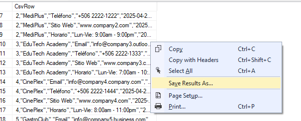

Y finalmente nos sale que es de tipo .csv


---
# Concurrencia

---
# Soltura ft. PaymentAssistant
